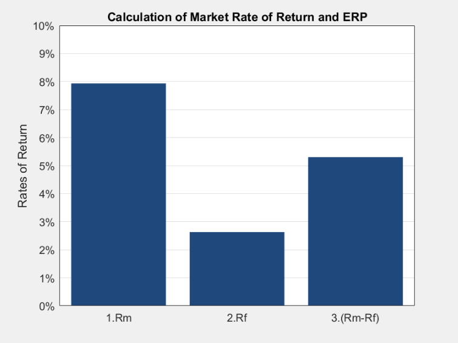

# MATLAB Rm & ERP Calculator
This is a simple calculator for estimating the market rate of return and equity risk premium for use in valuation.

-----------------------------------------------------------------------------------------------------------------
To use this function, the primary source of data has been Dr. Aswath Damodaran's work on equity risk premia. 

The function is modeled after his algorithm for determining the equity risk premium in the US, stated as an Excel model,
here automated with MATLAB. The required arguments are the price of the index (spx), the base year dividends and 
buybacks (cf0), a 3-year estimate of future earnings on the index (the projected future earnings on all of the component 
companies of the S&P, adjusted to match the units of the index, here denoted, est), and finally the risk free rate (Rf). 
Here, the risk free rate is the yield to maturity on the 10-Year US Treasury, but other rates could also be used as Rf.

Within MATLAB this function can be used to produce an output consisting of the market rate of return (Rm),

```
x = Rm(spx,cf0,est,Rf,1);
```

or a table summarizing the market rate of return, the risk free rate, and the equity risk premium (Rm-Rf),

```
x = Rm(spx,cf0,est,Rf,2);
```

where, depending on the final argument of the function, the mode variable, we can produce either only Rm or the
results table. The default setting consists of an output of just Rm.

-----------------------------------------------------------------------------------------------------------------



What is the equity risk premium? The equity risk premium, (Rm-Rf), is the average rate of return to be required of
equities as a class, over and above the risk free rate. Under the Capital Asset Pricing Model, the equity risk
premium is used in determining the cost of equity capital. This is the discount rate associated with the equity
capital funding of a business. The idea is that this rate is descriptive of the expected risk and required level of return
associated with this source of funding.

Using this quantity, we can discount future cash flows to the company's equity, or using the Weighted Average 
Cost of Capital, we can discount future cash flows to the entire business.

The process for calculating the cost of equity capital consists of,

Re = Rf + Beta*(Rm-Rf)

where using this tool in conjunction with our beta calculator, or that provided by equities research services, 
we can estimate the cost of equity on any publicly traded business we might be interested in. In the instance 
of valuing private businesses, which do not have an exchange traded equity instrument, the theoretical beta 
of those companies can be estimated from among a set of publicly traded comparables within the company's industry.
Although companies of the comparables set may be much larger, in terms of revenue or market capitalization
as two possible measures of size, there are scaling factors that could be used to adjust for the additional risk 
expected to be associated with smaller companies.

Typically the process involves the addition of a size premium to the cost of equity calculation,

Re = Rf + Beta*(Rm-Rf) + SP.
